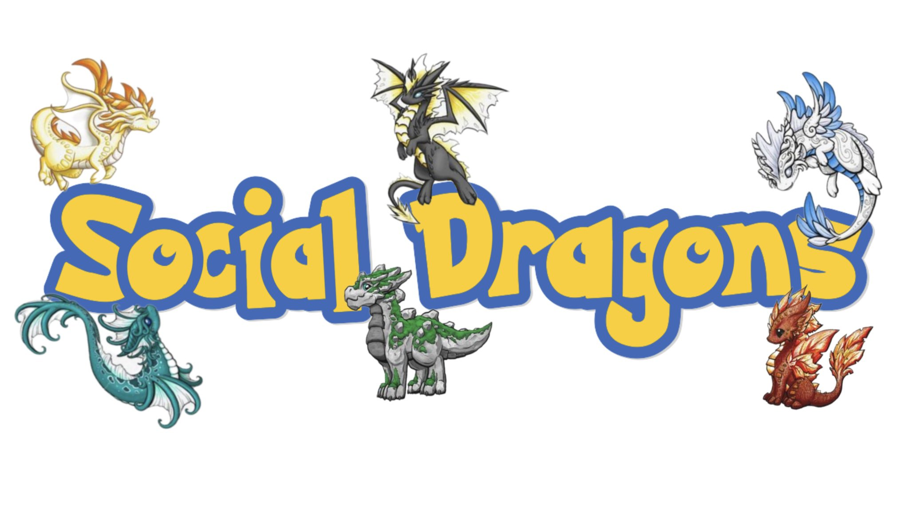

# NeuroMatch Project

## Project Name: Are we by default social?

## Group name: `Social Dragons`

## Group Members:

- Alex Xinyi Ye
- Ayan Mahapatra
- Deng Pan
- Fatma Çelebi
- Jialin Li

## Mentor and TAs

- Sina Mansour L. our Project Mentor
- Emeka Ogbuju our Project TA
- Ashish Sahoo our Coursework TA

## Final Presentation

- [Google Slides](https://docs.google.com/presentation/d/1QlrshFZ2uI2rP4hHM5ODnVScYlx0EoiYidcmoK9xkaI/edit?usp=sharing)
- [PPTX](./Presentation_and_Notes/social_dragon_presentation_final.pptx)

## Introduction:

Previous studies have demonstrated that the activation patterns of the brain during mentalizing are similar to that of the default mode network (Spunt & Lieberman, 2012; Mars et al. 2012). While mentalizing is a kind of social cognition, other researchers have found that the neural basis of social cognition and the default mode network correlate. Specifically, the overlapped areas are the precuneus, which is found to engage in social interaction (Schilbach et al., 2006); the temporoparietal junction area (TPJ), which involves in the differentiation between self and others (Vogeley and Fink, 2003); the anterior cingulate, which relates to monitoring the action from self and others (Amodio and Frith, 2006). Together, this evidence implies that the human brain might have a natural tendency to process social information when a resting state. Hereby, we asked whether there are similar brain networks between social cognition and the default mode network.

## Hypothesis:

Our hypothesis is that the similarity between social cognition brain networks and resting state (default mode network) is higher than the similarity between other conditions in the HCP dataset and resting state.

## Methods:

We plan to compare the data of the theory of mind (ToM) condition and the data of the resting state condition in the HCP dataset first. To control the baseline, we will compare the data of the control condition, which is the random condition in the social cognition task, and the resting state data. Additionally, we will also investigate the relationship between data from other cognition tasks, such as language tasks and math tasks, and the resting state data. We will pick some ROIs to compare or do the whole brain analysis, then calculate the dissimilarity matrices for each comparison.

## Expected Results:

We expected to see the largest similarity in connectivity of brain regions between the ToM condition and the resting state, other comparisons will be less similar.

## Abstract

Previous studies have demonstrated that the activation patterns of the brain during mentalizing are similar to that of the Default Mode Network (DMN). While mentalizing is a kind of social cognition, the neural basis of social cognition and the default mode network has been proven correlated. It might imply that the human brain might have a natural tendency to process social information when in a resting state. Hereby, we asked whether there are similar brain networks between social cognition and DMN. Our main hypothesis is that the similarity between social cognition brain networks and resting state is higher than the similarity between other conditions and resting state in the Human Connectome Project (HCP) dataset. We expected to see the largest similarity in connectivity of brain regions between the theory of mind condition and the resting state, other comparisons will be less similar. The figure below clarifies our expected results. We used Pearson correlation to compute the similarity. After the primary analysis, we found that the story condition from the language task had the highest correlation with the resting state, which contrasted with our hypothesis. Potential reasons are following: Firstly, we suspect that baseline control might be a factor influencing our result – as social tasks require watching the stimuli, while language tasks only require listening to the stimuli, it could be possible that by subtracting data of the random condition (control condition) from that of the ToM condition, noise from lower-level processing can be eliminated. In this way, the correlation results might be improved. The other potential reason is that the story condition does have a correlation to the DMN since it might contain more social information than the ToM condition. We plan to find some literature support for this result. Additionally, since there are overlapped brain areas involved in both social and language tasks (e.g. PFC), we plan to choose specific ROIs to further analyze the data.

## Two Main Analysis Methods:

- Pearson Correlation 
- Correlation between Covariance Connectivity

We do this for:

- Each participant in the HCP data subset
- Between the 4 task states
    - Mental and Random (Social Tasks)
    - Story and Math (Language Tasks)
- We also try these for specific ROIs

## Conclusion:

Overall, the brain connectivity within the story condition from the language experiment shares the highest similarity with the brain connectivity from the resting state.

Potential reason:

Stories used in the language experiment might include more social information (Binder et al. 2011).

## Future directions

- Can the brain activity in the resting state predict the brain activity in the language task or social task? 
- Does the story condition from the language task contain more social information? 

Limitation:

- Time series were not included in our analysis
- Only correlation analysis was performed
